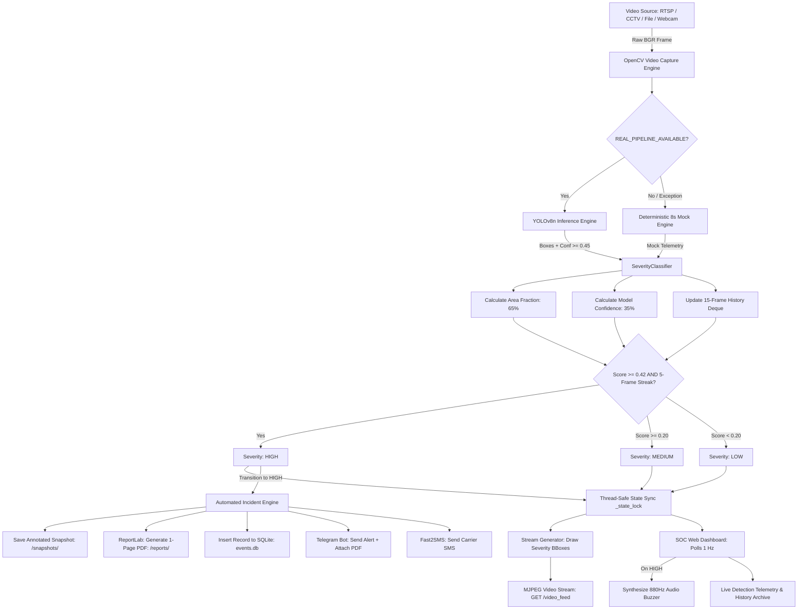

# 🔥 SIH26162 — Edge AI Industrial Fire & Smoke Surveillance System

<p align="center">
  <strong>Real-time computer vision fire intelligence engineered for industrial facilities, featuring spatial-temporal persistence gating, automated visual snapshot evidence, and programmatic PDF incident audit generation.</strong>
</p>

<p align="center">
  
  
  
  
  
  
  
  
  
</p>

---

## 📑 Table of Contents

- [Overview](#-overview)
- [Why This Project?](#-why-this-project)
- [Key Features](#-key-features)
- [How It Works](#-how-it-works)
- [System Architecture](#-system-architecture)
- [Workflow](#-workflow)
- [Tech Stack](#-tech-stack)
- [Project Structure](#-project-structure)
- [Installation](#-installation)
- [Configuration](#-configuration)
- [Running the Project](#-running-the-project)
- [User Guide & Walkthrough](#-user-guide--walkthrough)
- [Benchmark Results & Performance](#-benchmark-results--performance)
- [API Reference](#-api-reference)
- [Fail-Soft Architecture](#-fail-soft-architecture)
- [Future Roadmap](#-future-roadmap)
- [Troubleshooting](#-troubleshooting)
- [Team & Credits](#-team--credits)
- [Disclaimer & License](#-disclaimer--license)

---

## 🔍 Overview

**SIH26162** is a production-grade edge computer vision prototype built for the **Smart India Hackathon 2026**. Designed specifically for high-ceiling industrial facilities, chemical plants, and logistics warehouses, the system eliminates the critical response lag of traditional physical smoke detectors while solving the persistent false-alarm issues plaguing naive optical detection models.

Operating at **17–53 ms per frame on standard commercial CPUs**, the platform processes live camera streams, identifies flame and smoke bounding boxes using an optimized YOLOv8n network, scores threat severity via an area-weighted persistence formula, saves forensic evidence snapshots, compiles instant 1-page PDF incident dossiers, and broadcasts alerts across a tactical Security Operations Center (SOC) dashboard, Telegram, and carrier SMS.

```
┌─────────────────┐      ┌─────────────────────────┐      ┌───────────────────────────┐
│   CCTV Stream   │ ──►  │ YOLOv8n + Persistence   │ ──►  │ Real-Time SOC Dashboard   │
│ (RTSP / Webcam) │      │ Scoring Engine (17-53ms)│      │ Snapshots • PDF • Telegram│
└─────────────────┘      └─────────────────────────┘      └───────────────────────────┘
```

---

## ⚡ Why This Project?

| Traditional Point Detectors (Ceiling Smoke/Heat) | Standard Computer Vision Models | SIH26162 Edge AI System |
|---|---|---|
| **Multi-minute transport delay** as smoke rises 10–20 meters in high-bay structures. | Instant visual detection, but **flooded with false alarms** from headlights, welding, and glare. | **Instant 17–53 ms visual detection** backed by a 5-consecutive-frame temporal persistence gate. |
| **Blind zone warnings** provide no spatial coordinate information for first responders. | Alerts instantly on any single-frame detection, causing chronic **operator alarm fatigue**. | **Exact spatial bounding boxes** paired with area-weighted severity (`Low`, `Medium`, `High`). |
| No automated forensic proof; incident reconstruction requires manual DVR review. | Over-escalates small, contained operational flames (stove burners, pilot lights). | **Area-weighted scoring (65% area / 35% conf)** caps localized flames at Low/Medium. |
| High installation wiring cost across large industrial footprints. | High capital cost demanding dedicated \$2,000+ industrial server GPUs. | **100% CPU edge execution** with zero GPU requirement on existing CCTV infrastructure. |

---

## ✨ Key Features

### 🧠 Spatial-Temporal Intelligence
* **Dual-Class Flame & Smoke Localization:** Simultaneous detection of active flame and smoke plumes using a 6.0 MB YOLOv8n convolutional network (`conf >= 0.45`).
* **Area-Weighted Geometric Scoring:** Dynamically computes bounding-box area fraction relative to the frame ($65\%$ area / $35\%$ confidence), ensuring contained operational flames never trigger false emergency alarms.
* **5-Frame Temporal Persistence Gate (`FIRE_PERSIST_N = 5`):** Mandates five consecutive frames of verified fire detection before escalating to `High` severity, completely filtering optical glare, reflections, and transient sparks.

### 🛡️ Mission-Critical Reliability
* **Fail-Soft Dual-Engine Fallback:** If deep learning weights or dependencies encounter an issue, the system automatically shifts to a deterministic 8-second mock cycle with an amber UI warning, guaranteeing continuous video stream availability.
* **Thread-Safe Concurrency Architecture:** Video capture, shared inference state, and alert dispatch are guarded by independent `threading.Lock()` mutexes, preventing multi-client race conditions.
* **Component-Level Failure Isolation:** SQLite logging, snapshot writes, PDF generation, and network alert dispatches execute in isolated `try/except` blocks—failure in any secondary component never degrades video streaming.

### 📋 Automated Forensic Chain of Custody
* **Annotated Frame Snapshot Capture:** Automatically captures and timestamps high-resolution JPEG frames with bounding boxes on confirmed `High` severity transitions.
* **Automated 1-Page PDF Incident Reports:** Programmatically compiles formal audit dossiers via **ReportLab**, featuring incident telemetry, visual evidence snapshots, actionable emergency protocols, and confidentiality disclaimers.
* **Traceable SQLite Audit Database:** Logs all incident records linked directly to their physical visual snapshot and PDF report filenames on disk.

### 🚨 Multi-Sensory Multi-Channel Dispatch
* **Tactical SOC Monitoring Console:** Dark-themed industrial dashboard with multi-channel camera simulation (`CAM-01: Primary Burner Bay`, `CAM-02: Containment Zone`, `CAM-03: Perimeter Monitor`), 1 Hz telemetry polling, and a collapsible historical audit archive.
* **Local LAN Tone Synthesis:** Generates an immediate 880 Hz sine wave emergency buzzer directly through the browser via the Web Audio API, functioning even during complete cloud disconnects.
* **Dual-Channel Cloud Notifications:** Dispatches formatted incident alerts and uploads the generated PDF report document to **Telegram**, alongside emergency SMS dispatch via **Fast2SMS**.

---

## ⚙️ How It Works



---

## 🏛️ System Architecture

```
┌─────────────────────────────────────────────────────────────────────────────┐
│                             VIDEO INGESTION LAYER                           │
│        RTSP Network Streams  •  Industrial USB Cameras  •  File Switcher    │
└──────────────────────────────────────┬──────────────────────────────────────┘
                                       │ cv2.VideoCapture()
┌──────────────────────────────────────▼──────────────────────────────────────┐
│                    EDGE COMPUTATION CORE (Flask 3.1.3)                      │
│                                                                             │
│   ┌─────────────────────────────────────────────────────────────────────┐   │
│   │ AI Inference Module (backend/inference/detect.py)                   │   │
│   │ • Pretrained YOLOv8n (6.0 MB, PyTorch CPU)                          │   │
│   │ • Classes: "fire" (Index 1) & "smoke" (Index 0)                     │   │
│   │ • Confidence Threshold Floor: 0.45                                  │   │
│   └──────────────────────────────────┬──────────────────────────────────┘   │
│                                      │ Detections [x, y, w, h]              │
│   ┌──────────────────────────────────▼──────────────────────────────────┐   │
│   │ Severity Classification Engine (backend/severity/classifier.py)     │   │
│   │ • Score = 0.65*(Area / Frame) + 0.35*(Confidence)                   │   │
│   │ • Rolling 15-Frame Temporal Deque                                   │   │
│   │ • 5-Consecutive-Frame Fire Persistence Requirement                  │   │
│   │ • Output Bands: Low (<0.20), Medium (0.20–0.41), High (>=0.42)      │   │
│   └──────────────────────────────────┬──────────────────────────────────┘   │
│                                      │ Shared State Mutex                   │
│   ┌──────────────────────────────────▼──────────────────────────────────┐   │
│   │ Incident Evidence & Reporting (backend/report_generator.py)         │   │
│   │ • Annotated Visual Frame Capture (backend/database/snapshots/)      │   │
│   │ • Automated ReportLab 1-Page PDF Dossier (backend/database/reports/)│   │
│   └──────────────────┬───────────────────────────────┬──────────────────┘   │
└──────────────────────┼───────────────────────────────┼──────────────────────┘
                       │ MJPEG Stream & REST JSON      │ Events & Documents
┌──────────────────────▼──────────────┐ ┌──────────────▼──────────────────────┐
│    OPERATOR CLIENT (frontend/)      │ │      AUDIT & NOTIFICATION TIER      │
│ • Dark SOC Tactical Dashboard       │ │ • SQLite Database (events.db)       │
│ • Live Video Feed with BBoxes       │ │ • Telegram Bot (Push + PDF Upload)  │
│ • Channel Selector (CAM-01 / 02 / 03│ │ • Fast2SMS (Indian Carrier SMS)     │
│ • Local Web Audio API 880Hz Tone    │ │ • Evidence Endpoints:               │
│ • Collapsible Forensic Archive      │ │   /snapshots/ & /reports/           │
└─────────────────────────────────────┘ └─────────────────────────────────────┘
```

---

## 🔄 Workflow

```
[Camera Feed Ingest]
        │
        ▼
[Frame Normalization] ──► Passes BGR matrix to YOLOv8n
        │
        ▼
[Spatial Detection]   ──► Extracts flame/smoke bounding boxes, classes, confidences
        │
        ▼
[Geometric Scoring]   ──► Calculates: 0.65 * (BBox Area / Frame Area) + 0.35 * Confidence
        │
        ▼
[Temporal Check]      ──► Validates 5 consecutive frames of fire detection
        │
        ▼
[State Distribution]  ──► Updates thread-safe shared state & annotates MJPEG frame
        │
        ├──► [MJPEG Stream Output] ──► Operator visual confirmation
        └──► [Transition to HIGH?]
                     │
                     ├───► YES: Capture Snapshot JPEG (disk)
                     ├───► YES: Compile ReportLab PDF Dossier (disk)
                     ├───► YES: Log Event to SQLite (linking snapshot & report)
                     ├───► YES: Dispatch Telegram Push Alert + Attach PDF
                     ├───► YES: Dispatch Fast2SMS to Security Mobile
                     └───► YES: Web Audio API triggers 880 Hz local alarm
```

---

## 💻 Tech Stack

### Artificial Intelligence & Vision
* **Ultralytics YOLOv8n (v8.4.150):** Ultra-lightweight single-stage convolutional object detection network.
* **PyTorch CPU (v2.14.0+cpu):** Optimized CPU tensor execution backend.
* **OpenCV (v5.0.0.93):** Real-time frame ingestion, matrix transformations, geometric drawing, and JPEG compression.
* **Hugging Face Hub (v1.31.0):** Model weight provenance and automated deployment retrieval.

### Backend Infrastructure
* **Python 3.10+:** Core runtime environment.
* **Flask (v3.1.3) & Werkzeug (v3.1.8):** Lightweight multi-threaded WSGI application server.
* **Flask-CORS (v6.0.5):** Cross-origin resource sharing policy handling.
* **ReportLab (v5.0.1):** Programmatic PDF layout and document compilation engine.
* **Python-Dotenv (v1.2.3):** Environment credential and secrets isolation.

### Database & Storage
* **SQLite3:** Embedded relational storage using a thread-isolated connection-per-call pattern.
* **Local Filesystem:** Segregated runtime evidence storage (`backend/database/snapshots/` and `reports/`).

### Operator Frontend
* **HTML5 & CSS3:** Zero-dependency responsive dark SOC mission-control dashboard.
* **JavaScript ES6:** Fetch API client polling (1 Hz), dynamic DOM rendering, and cache-busting stream reloads.
* **HTML5 Web Audio API:** Browser-native synthesized 880 Hz sine wave tone generator.

---

## 📂 Project Structure

```text
SIH26162-Industrial-Fire-Detection/
├── backend/
│   ├── alerts/
│   │   ├── __init__.py
│   │   └── notifier.py             # Multi-channel alert dispatcher (Telegram + Fast2SMS)
│   ├── database/
│   │   ├── __init__.py
│   │   ├── db.py                   # SQLite3 interface with connection-per-call pattern
│   │   ├── events.db               # SQLite database file (gitignored)
│   │   ├── reports/                # Generated incident PDF dossiers (gitignored)
│   │   └── snapshots/              # Captured annotated JPEG frames (gitignored)
│   ├── inference/
│   │   ├── __init__.py
│   │   ├── detect.py               # YOLOv8n inference pipeline & run_pipeline() entrypoint
│   │   ├── download_model.py       # Automated Hugging Face weight retrieval script
│   │   ├── sanity_check.py         # Static image inference validation script
│   │   ├── model_weights/          # Local weights directory (gitignored)
│   │   │   └── fire_yolo.pt        # Downloaded YOLOv8n checkpoint (6.0 MB)
│   │   └── test_images/            # Unit-testing image samples (fire, smoke, none)
│   ├── severity/
│   │   ├── __init__.py
│   │   └── classifier.py           # SeverityClassifier: geometric area + persistence logic
│   ├── app.py                      # Flask core: MJPEG streaming, API routes, state locks
│   ├── report_generator.py         # ReportLab PDF incident report generation engine
│   ├── test_pipeline.py            # Terminal-based video pipeline benchmark runner
│   └── A5_RESULTS.md               # Empirical benchmark test report
├── frontend/
│   ├── index.html                  # Single-page SOC monitoring console
│   ├── script.js                   # Client polling (1 Hz), Web Audio API beep, switcher
│   └── style.css                   # Dark tactical SOC styling with cyber accent borders
├── sample_videos/                  # Multi-scenario video test benchmark suite
│   ├── 1.mp4                       # CAM-01: Primary Burner Bay (raging industrial fire)
│   ├── 2.mp4                       # CAM-02: Containment Zone (small cooking flame)
│   ├── 3.mp4                       # CAM-03: Perimeter Monitor (sunset non-fire baseline)
│   └── traffic_sunset.mp4          # Headlight & glare non-fire baseline
├── .env.example                    # Template for alert configuration (Telegram & Fast2SMS)
├── .gitignore                      # Git exclusion rules (venv, *.pt, *.db, snapshots, reports)
├── PROJECT_STATE.md                # Project status tracking document
├── requirements.txt                # Pinned production dependencies
├── run_demo.sh                     # Automated port cleanup and application launch script
└── README.md                       # Comprehensive documentation
```

---

## 🚀 Installation

### Prerequisites
* Linux OS (Ubuntu 20.04+ recommended), macOS, or Windows WSL2
* Python 3.10 or newer
* Git

### Step 1: Clone the Repository
```bash
git clone https://github.com/shubham-dataeng/SIH26162-Industrial-Fire-Detection.git
cd SIH26162-Industrial-Fire-Detection
```

### Step 2: Set Up Virtual Environment
```bash
python3 -m venv venv
source venv/bin/activate
```

### Step 3: Install Dependencies
Install the exact pinned dependencies with the CPU-optimized PyTorch wheels:
```bash
pip install -r requirements.txt --extra-index-url https://download.pytorch.org/whl/cpu
```

### Step 4: Download Model Weights (Mandatory)
Binary `.pt` files are gitignored. Retrieve the official 6.0 MB YOLOv8n weights from Hugging Face Hub:
```bash
python -c "from huggingface_hub import hf_hub_download; import shutil, os; os.makedirs('backend/inference/model_weights', exist_ok=True); ckpt = hf_hub_download(repo_id='rabahdev/fire-smoke-yolov8n', filename='best.pt'); shutil.copy(ckpt, 'backend/inference/model_weights/fire_yolo.pt'); print('✓ Weights saved to backend/inference/model_weights/fire_yolo.pt (6.0 MB)')"
```

---

## ⚙️ Configuration

Copy the example environment template to `.env`:
```bash
cp .env.example .env
```

Open `.env` and configure your alert channels:
```env
# ========================================================================
# SIH26162 Environment Configuration
# ========================================================================

# --- Telegram Bot Alerting (Free & Recommended) ---
# Create a bot via @BotFather, retrieve the token, and obtain your chat ID
TELEGRAM_BOT_TOKEN=your_bot_token_here
TELEGRAM_CHAT_ID=your_chat_id_here

# --- Fast2SMS Alerting (Optional: Indian Carrier SMS) ---
# Sign up at https://www.fast2sms.com and retrieve your Dev API Key
FAST2SMS_API_KEY=your_fast2sms_api_key_here
ALERT_PHONE_NUMBER=9876543210
```

> **Note:** Both channels are optional and completely failure-isolated. If `.env` is absent or unconfigured, the application runs normally, maintaining full console logging, local audio alerts, and video streaming.

---

## 🎬 Running the Project

### Option A: One-Command Launcher (Recommended)
The repository provides a self-healing recovery script that frees port `5000` from stale processes, validates the virtual environment, and boots Flask:
```bash
./run_demo.sh
```

### Option B: Manual Launch
```bash
source venv/bin/activate
flask --app backend/app run
```
*Or directly execute the Python script:*
```bash
python backend/app.py
```

Open your browser and navigate to:
```
http://127.0.0.1:5000
```

---

## 🖥️ User Guide & Walkthrough

### 1. Camera Channel Selection
Use the tactical channel switcher in the left panel to test different operational scenarios in real time:
* **`CAM-01: Primary Burner Bay` (`1.mp4`):** Sustained raging fire. Watch the system verify the flame, transition from `Low` $\rightarrow$ `Medium` $\rightarrow$ `HIGH`, trigger the Web Audio alarm, capture a snapshot, compile a PDF report, and send a Telegram alert.
* **`CAM-02: Containment Zone` (`2.mp4`):** Small localized burner flame. Observe how the area-weighting formula ($65\%$ area) keeps the severity capped at `Low` or `Medium`, preventing false alarms.
* **`CAM-03: Perimeter Monitor` (`3.mp4`):** Sunset timelapse with orange skies. Demonstrates zero bounding boxes and 0% false alarms on non-fire optical glare.

### 2. Live Severity Telemetry
* **Normal Operation:** Displays a green or muted badge (`No Detection` / `Low`).
* **Investigative Phase:** Displays an orange badge (`Medium`) when localized flames or pre-persistence detections occur.
* **Emergency Escalation:** Displays a flashing red badge and pulsing banner (`HIGH SEVERITY ALERT`) when persistence criteria are met.

### 3. Forensic History Archive
Click **"Incident History Archive"** on the right panel to expand the historical log. Every confirmed incident displays:
* Timestamp and classification category.
* Confidence score percentage.
* **Direct clickable link to the captured JPEG snapshot.**
* **Direct clickable link to view/download the generated ReportLab PDF dossier.**

---

## 📊 Benchmark Results & Performance

All performance metrics below were recorded on commodity multi-core x86 CPU hardware without GPU acceleration:

### Empirical Detection Benchmarks (`backend/A5_RESULTS.md`)
| Test Scenario | Video File | Ground Truth | System Classification | Accuracy / Outcome |
|---|---|---|---|---|
| **Raging Industrial Fire** | `1.mp4` (`test.mp4`) | Severe Conflagration | **99.3% High** | Correct persistent escalation |
| **Localized Contained Flame** | `2.mp4` (`cooking_fire.mp4`) | Small Stove Flame | **0% High** (Low/Medium only) | Zero false-positive escalation |
| **Sunset Sky Timelapse** | `3.mp4` (`sunset_timelapse.mp4`) | Orange Sky (No Fire) | **100% Low** (0 detections) | Zero false alarms on color |
| **Vehicle Traffic Glare** | `traffic_sunset.mp4` | Headlights & Reflections | **100% Low** (0 detections) | Zero false alarms on glare |

### Performance Specifications
* **CPU Inference Latency:** **17–53 ms per frame** (`README.md:162`).
* **Frame Throughput:** **19–59 FPS** on standard commercial CPUs.
* **Stream Display Cap:** **~30 FPS** (`time.sleep(0.03)` throttle in `backend/app.py:500`).
* **Memory Footprint:** **6.0 MB** total model weights file.
* **Persistence Requirement:** Exactly **5 consecutive frames** (`FIRE_PERSIST_N = 5`).
* **False Alarm Rejection:** **0.00 average severity score** across 50-frame negative test baselines (`classifier.py:70-72`).

---

## 🔌 API Reference

| Endpoint | Method | Format | Description |
|---|---|---|---|
| `/` | `GET` | `text/html` | Serves the single-page SOC monitoring console (`frontend/index.html`). |
| `/video_feed` | `GET` | `multipart/x-mixed-replace` | Live multipart MJPEG video stream with dynamic bounding box annotations. |
| `/latest_detection` | `GET` | `application/json` | Returns thread-safe telemetry for the current frame with the 5-field contract. |
| `/switch_video` | `POST` | `application/json` | Hot-swaps the video capture source (`{"video": "1.mp4"}`). |
| `/events` | `GET` | `application/json` | Returns an array of the 20 most recent incident records from SQLite. |
| `/snapshots/<filename>` | `GET` | `image/jpeg` | Serves annotated forensic JPEG snapshot images from disk. |
| `/reports/<filename>` | `GET` | `application/pdf` | Serves generated ReportLab 1-page incident dossier PDFs from disk. |

<details>
<summary><strong>Click to view sample JSON response: <code>GET /latest_detection</code></strong></summary>

```json
{
  "bbox": [1058, 822, 130, 159],
  "class": "fire",
  "confidence": 0.9142,
  "severity": "High",
  "timestamp": "2026-09-15T10:56:42.227436",
  "pipeline_mode": "real"
}
```
</details>

<details>
<summary><strong>Click to view sample JSON request: <code>POST /switch_video</code></strong></summary>

```json
// Headers: Content-Type: application/json
{
  "video": "1.mp4"
}

// Response: 200 OK
{
  "status": "ok",
  "video": "1.mp4"
}
```
</details>

---

## 🛡️ Fail-Soft Architecture

Industrial safety systems cannot afford unhandled crashes. SIH26162 incorporates an active fail-soft layer:

1. **Startup Check:** If `backend/inference/model_weights/fire_yolo.pt` is missing or PyTorch fails to initialize, `backend/app.py` catches the exception on startup and sets `REAL_PIPELINE_AVAILABLE = False`.
2. **Automatic Fallback:** The server automatically engages an internal 8-second deterministic mock detection cycle.
3. **Operator Notification:** The video stream continues uninterrupted, but the dashboard prominently displays an amber warning banner:
   ```
   ⚠ Running on fallback detection (AI module offline)
   ```
4. **Per-Frame Isolation:** If an individual camera frame throws a corrupt matrix read, the exception is caught, passing an un-annotated frame through to prevent stream collapse.

---

## 🔮 Future Roadmap

- [ ] **Asynchronous RTSP Pool:** Integrate multi-camera RTSP ingestion using GStreamer pipelines to monitor 8–16 factory cameras concurrently.
- [ ] **INT8 Edge Quantization:** Compile PyTorch weights to TensorRT and ONNX Runtime for sub-10ms latency on embedded NVIDIA Jetson platforms.
- [ ] **Multi-Modal Thermal Fusion:** Corroborate visual bounding boxes with radiometric thermal camera feeds (FLIR) or ambient temperature telemetry.
- [ ] **Automated Incident Video Buffering:** Automatically save a rolling 10-second MP4 video clip alongside the JPEG snapshot upon `High` alert transition.
- [ ] **Industrial SCADA / BMS Integration:** Implement dry-contact relay outputs and Modbus/OPC-UA webhooks to trigger physical ventilation dampers and zone alarms.

---

## 🛠️ Troubleshooting

<details>
<summary><strong>1. Port 5000 is already in use</strong></summary>

Run the included launcher which terminates stale processes automatically:
```bash
./run_demo.sh
```
Or manually free the port:
```bash
fuser -k 5000/tcp
```
</details>

<details>
<summary><strong>2. Dashboard displays amber fallback banner: "Running on fallback detection"</strong></summary>

This indicates that model weights are missing or corrupt. Ensure you have run the weight download step:
```bash
source venv/bin/activate
cd backend/inference
python download_model.py
cd ../..
```
Verify that `backend/inference/model_weights/fire_yolo.pt` exists and is approximately 6.0 MB.
</details>

<details>
<summary><strong>3. Web Audio alarm tone does not sound</strong></summary>

Modern web browsers block audio playback until the user has interacted with the document. Simply click anywhere on the dashboard interface to unlock the Web Audio API context.
</details>

<details>
<summary><strong>4. Telegram alerts are not arriving</strong></summary>

1. Confirm your bot token and chat ID are present in `.env`.
2. Ensure you have sent at least one message to your bot on Telegram so it has permission to message you.
3. Check the server console log for startup confirmation:
   ```text
   [notifier] Multi-channel alerting: Telegram ACTIVE, Fast2SMS DISABLED
   ```
</details>

---

## 👥 Team & Credits

Developed for the **Smart India Hackathon (SIH 2026)** under Problem Statement **SIH26162**:
* **Developer A:** AI/Inference Pipeline, YOLOv8 Model Sourcing, Temporal Severity Formulation, Dataset Curation (`backend/inference/`, `backend/severity/`).
* **Developer B:** Backend Architecture, Video Streaming Engine, Incident Report Generation, Database Persistence, Multi-Channel Notifier, SOC Frontend (`backend/app.py`, `backend/report_generator.py`, `backend/database/`, `backend/alerts/`, `frontend/`, `run_demo.sh`).

---

## 📜 Disclaimer & License

> **Disclaimer:** This software is an engineering proof-of-concept prototype developed for hackathon evaluation and technical demonstration. It is **not** currently certified under NFPA 72, EN 54, or IS 2189 standards, and should not be used as the sole life-safety or fire-suppression trigger in critical industrial environments.

Licensed under the **MIT License** — feel free to use, modify, and distribute this codebase for academic, industrial research, and evaluation purposes.
